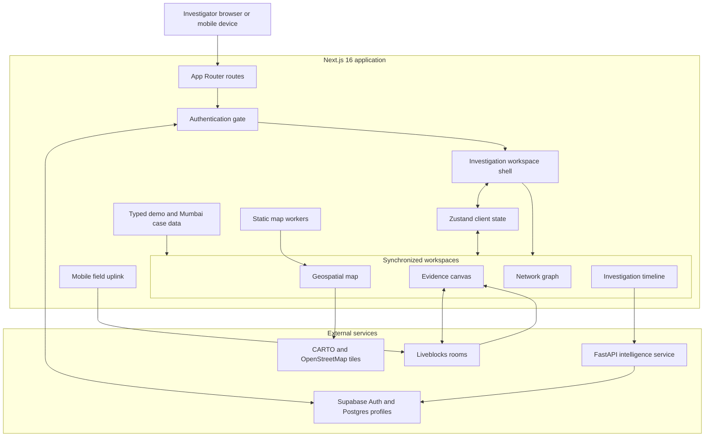
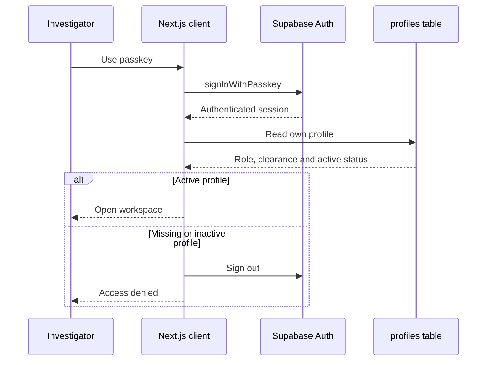
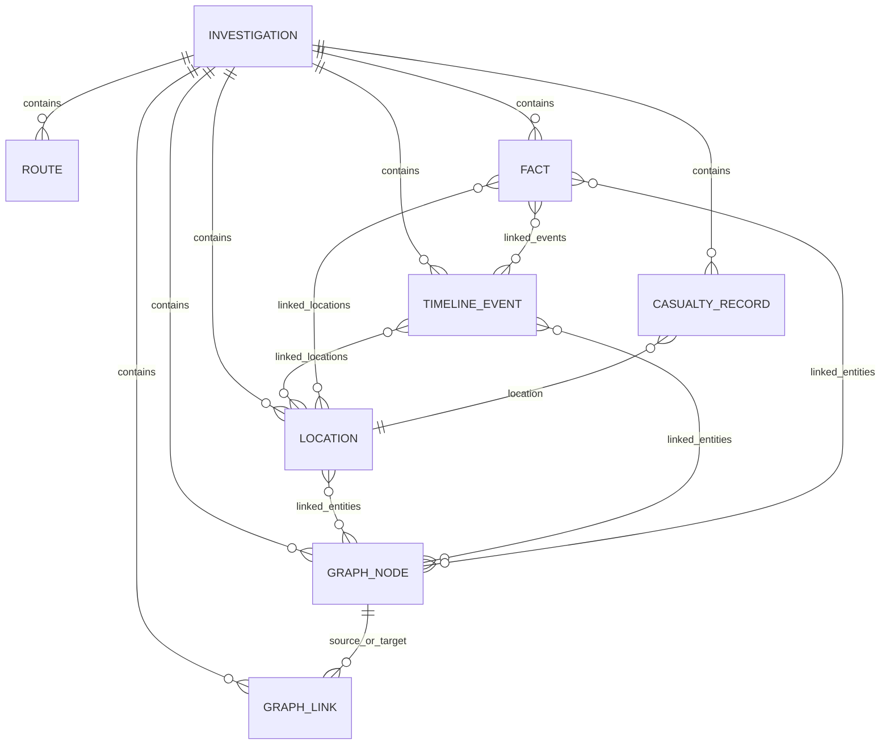
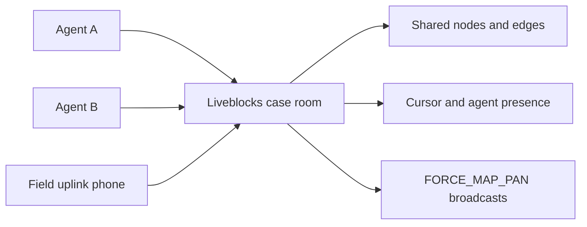
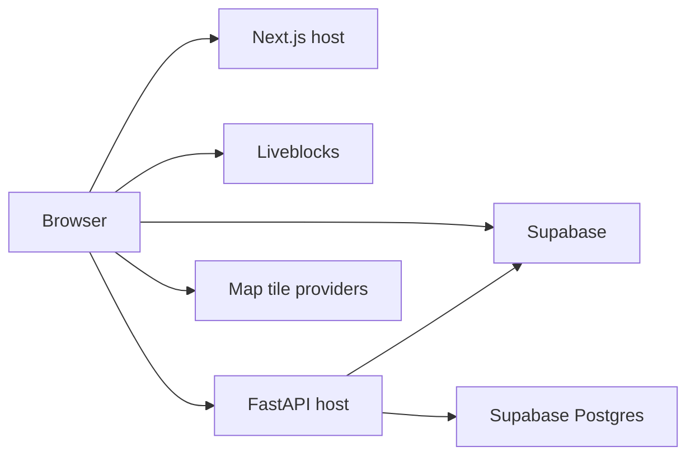
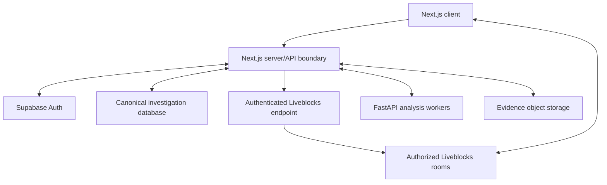

# The Fatal Ledger — System Architecture

Last reviewed: 17 August 2026

## 1. System overview

The Fatal Ledger is a browser-first investigation platform with two application runtimes:

- A Next.js/React frontend containing the main workspace, investigation data, maps, graphs, timeline, and collaboration UI.
- A small authenticated FastAPI service used by the demo Blind-Spot Detector.

Supabase provides identity and investigator profiles. Liveblocks provides real-time collaboration and shared evidence-board storage.



## 2. Technology stack

| Layer | Technology | Responsibility |
|---|---|---|
| Web framework | Next.js 16 App Router | Pages, routing, production build, static assets |
| User interface | React 19 and TypeScript | Component system and type safety |
| Styling | Tailwind CSS 4 and global CSS | Responsive analog-brutalist visual system |
| Local state | Zustand | Case, workspace, filters, selections and local board state |
| Evidence canvas | React Flow | Evidence cards, nodes, edges and dragging |
| Network graph | React Flow and Dagre | Investigation relationships and graph layout |
| Geospatial rendering | MapLibre, react-map-gl and Deck.gl | Maps, pins, routes, heatmaps and 3D density |
| Collaboration | Liveblocks | Room storage, cursors, presence and broadcast events |
| Authentication | Supabase Auth | Passkey authentication, sessions and enrollment emails |
| Authorization data | Supabase Postgres | Investigator profile, role, clearance and active status |
| Intelligence API | FastAPI and Pydantic | Authenticated demo timeline analysis |
| Backend database access | Psycopg | Loading authorization profiles from Postgres |
| Theme and animation | next-themes and Framer Motion | Dark/light theme and UI transitions |

## 3. Repository structure

```text
fatal/
├── app/                         Next.js routes and root styling
│   ├── page.tsx                 Login entry point
│   ├── workspace/page.tsx       Main investigation workspace
│   ├── dashboard/page.tsx       Workspace alias
│   ├── enroll/page.tsx          Account confirmation and passkey enrollment
│   ├── security/page.tsx        Passkey management
│   └── uplink/page.tsx          Mobile field uplink
├── components/                  Workspace and interface components
├── data/investigations/         Typed investigation source data
├── lib/                         Auth, Liveblocks and board-storage utilities
├── store/                       Zustand investigation store
├── backend/                     FastAPI intelligence service
├── supabase/                    Local config and database migrations
├── public/                      Static MapLibre workers
├── liveblocks.config.ts         Liveblocks event type declarations
├── next.config.ts               Next.js and Deck.gl configuration
└── package.json                 Frontend dependencies and scripts
```

## 4. Frontend application architecture

The main shell is `components/investigation-workspace.tsx`. It owns:

- The Fatal Ledger header.
- Investigation switching.
- Desktop and mobile workspace navigation.
- Responsive Fact Ledger presentation.
- Command palette and QR uplink modal.
- Liveblocks collaboration wrapper.
- Light/dark themes and mobile safe-area layout.

`components/workspace-viewport.tsx` selects one of four workspaces:

| Workspace | Component | Purpose |
|---|---|---|
| Map | `GeospatialMapWorkspace` | Locations, movement routes, heatmaps, density and playback |
| Canvas | `Board` | Evidence notes, photographs and red-string connections |
| Network | `NetworkGraphWorkspace` | Entities, locations, teams, evidence and relationships |
| Timeline | `TimelineWorkspace` | Chronological events, filters and annotations |

The desktop layout uses a workspace bar and collapsible Fact Ledger. Mobile uses a bottom navigation bar and a full-height ledger drawer.

## 5. Routes and entry points

| Route | Access | Responsibility |
|---|---|---|
| `/` | Public | Passkey login in production; redirects to `/workspace` in development |
| `/workspace` | Authenticated in production | Main investigation workspace |
| `/dashboard` | Authenticated in production | Alias of the main workspace |
| `/enroll` | Public onboarding flow | Email confirmation and initial passkey enrollment |
| `/security` | Authenticated session | Passkey listing, registration, renaming and deletion |
| `/uplink?case=ROOM` | Currently public | Mobile field-intelligence submission terminal |

The authentication bypass is restricted to `NODE_ENV === "development"`. Production builds continue to require a Supabase session and active CrimeLens profile.

## 6. Authentication and authorization

Supabase is the identity authority.



### Authentication behavior

- Supabase browser sessions persist and automatically refresh.
- Production workspace access calls `supabase.auth.getUser()`.
- The application then loads the matching `public.profiles` row.
- Missing or inactive profiles are rejected and signed out.
- Enrollment uses email OTP with `shouldCreateUser: false`, so it cannot create an unapproved account.
- After email confirmation, the user can register a platform passkey.
- The security screen supports passkey listing, registration, renaming and deletion.

### Profile authorization model

The `public.profiles` table contains:

- `user_id`
- `agent_id`
- `display_name`
- `role`
- `clearance`
- `active`
- creation and update timestamps

Row Level Security allows an authenticated user to read only their own profile. Authenticated users cannot insert, update or delete authorization profiles. Profile provisioning is an administrative operation.

## 7. Investigation domain model

The main investigation source of truth is currently typed TypeScript data bundled into the frontend.

The registry contains two investigations:

- `demo`
- `mumbai-2611`

Each investigation contains:

- Case identity, dates, location, type and status.
- Verified summary totals.
- Geospatial locations and movement routes.
- Network graph nodes and relationship links.
- Timeline events.
- Casualty ledger records.
- Facts and evidence references.
- Source reference, confidence and time-precision metadata.

### Relationship model



The registry validates case data when it loads. Validation includes:

- Preventing objects from leaking between investigations.
- Requiring source metadata.
- Verifying graph link endpoints.
- Verifying casualty-location references.
- Checking coordinate verification status.
- Preventing approximate times from being marked exact.
- Checking Mumbai totals, attacker counts and timezone consistency.

## 8. Client state ownership

`store/use-investigation-store.ts` is the central Zustand store.

It controls:

- Active investigation and workspace.
- Timeline range and map playback date.
- Map playback status.
- Selected suspects, entities, locations and timeline events.
- Map layers, crime filters and spatial bounds.
- Cross-workspace map-pan requests.
- Fact Ledger state.
- Local evidence-board nodes and edges.
- Command palette and QR modal state.

Selections are shared across workspaces. For example, selecting an entity in the network can filter the timeline, identify map locations and expose connected evidence.

Most Zustand data is memory-only and resets after a page refresh.

## 9. Evidence board architecture

The evidence board has two operating modes.

### Local mode

When there is no Liveblocks case room, nodes and edges are stored in Zustand. The canvas remains fully interactive but changes are lost after refresh.

### Collaborative mode

When a case room is present, the Liveblocks room becomes the evidence-board source of truth.

Shared room storage contains:

- `LiveList<StoredFlowNode>`
- `LiveList<StoredFlowEdge>`

Mutations update individual list entries instead of clearing and rebuilding the entire list. This lets Liveblocks merge concurrent edits more safely.

Nodes can be temporarily locked to an agent while they are dragged, reducing conflicting position updates.

## 10. Real-time collaboration

Liveblocks is activated when the workspace URL includes a sanitized `?case=room-name` parameter.



A room contains:

- Persistent evidence nodes and edges.
- Ephemeral cursor coordinates.
- Ephemeral agent identifiers.
- Broadcast `FORCE_MAP_PAN` events.

Without a case parameter, the workspace deliberately stays local-only rather than falling into a shared default room.

The command palette can broadcast a map target to other connected agents. Receiving clients switch to the map workspace, pan to the coordinates and show an incoming-override notification.

## 11. QR field uplink

The main workspace can generate a QR code containing an `/uplink?case=...` URL.

The mobile uplink flow is:

1. A field device scans the QR code.
2. The uplink page joins the corresponding Liveblocks room.
3. The user submits an intelligence note.
4. A sticky-note node is inserted into shared room storage.
5. Connected investigators see the new item on the evidence canvas.

The current uplink route does not enforce investigator authentication.

## 12. Geospatial architecture

The main map uses:

- MapLibre GL for the interactive base map.
- `react-map-gl` for React integration.
- Deck.gl for GPU-rendered visualization layers.
- CARTO Voyager and Dark Matter map styles.
- A locally served MapLibre worker to avoid Webpack worker-bundling problems.

Supported visualization layers include:

- Scatterplot incident pins.
- Heatmaps.
- 3D hexagon density.
- Route paths.
- Animated movement arcs.
- Investigation-location markers.

The map reads time ranges, selected entities, selected locations, case routes, crime filters and pan requests from Zustand.

## 13. Network graph architecture

The network workspace presents investigation entities and links using React Flow.

Graph nodes can represent:

- Suspects and attackers.
- Teams and organizations.
- Planners.
- Locations.
- Responders.
- Evidence.
- Transactions.

Graph links can represent:

- Financial relationships.
- Phone relationships.
- Co-location.
- Team membership.
- Targets.
- Movement.
- Planning.
- Response.
- Evidence relationships.

Graph selection is connected to the shared Zustand selection model, allowing navigation from a relationship to related map and timeline information.

## 14. Timeline architecture

The Timeline workspace provides:

- Investigation-specific chronological events.
- Category and severity presentation.
- Zoom and navigation controls.
- Event annotations.
- Cross-links to entities and locations.
- Demo Blind-Spot Detector access.

The Blind-Spot button appears only for the demo investigation.

## 15. FastAPI intelligence service

The Python service exposes:

| Endpoint | Access | Responsibility |
|---|---|---|
| `GET /health` | Public | Service health check |
| `GET /api/v1/auth/me` | Supabase bearer token and active profile | Return the current investigator profile |
| `GET /api/v1/intel/timeline/{suspect_id}` | Supabase bearer token and active profile | Return events and computed blind spots |

Protected requests pass through two checks:

1. Validate Supabase token claims, issuer and audience.
2. Load the matching Postgres profile and require `active = true`.

### Blind-spot algorithm

The demo algorithm:

1. Loads and sorts a suspect's mock temporal events.
2. Detects gaps longer than 15 minutes.
3. Estimates a maximum travel radius using an average city speed.
4. Calculates camera distances with the Haversine formula.
5. Returns cameras intersecting the possible travel area.
6. Inserts a generated blind-spot item between the surrounding events.

If the API is unavailable, the frontend logs a warning and uses bundled demonstration data.

This service currently supports the demo Blind-Spot Detector only. The core workspace and Mumbai case do not depend on it.

## 16. Persistence matrix

| Information | Owner | Persistence |
|---|---|---|
| Users and sessions | Supabase Auth | Durable |
| Investigator profiles | Supabase Postgres | Durable and protected by RLS |
| Investigation datasets | TypeScript source | Versioned with application code |
| Local filters and selections | Zustand | Browser memory only |
| Local evidence board | Zustand | Browser memory only |
| Collaborative evidence board | Liveblocks storage | Durable per room |
| Cursors and broadcasts | Liveblocks presence/events | Ephemeral |
| Timeline annotations | React component state | Browser memory only |
| Blind-spot source data | FastAPI mock data | Bundled with backend code |

## 17. Environment configuration

### Browser-exposed frontend variables

```text
NEXT_PUBLIC_SUPABASE_URL
NEXT_PUBLIC_SUPABASE_PUBLISHABLE_KEY
NEXT_PUBLIC_SITE_URL
NEXT_PUBLIC_LIVEBLOCKS_PUBLIC_KEY
NEXT_PUBLIC_TIMELINE_INTEL_URL
```

These values are included in browser-delivered code. A service-role key or database password must never be placed in a `NEXT_PUBLIC_*` variable.

### Backend-only variables

```text
DATABASE_URL
SUPABASE_URL
SUPABASE_KEY
CORS_ORIGINS
```

These values must remain on the FastAPI server.

## 18. Deployment topology

A full production deployment requires:

- A host for the Next.js frontend.
- A Python/container host for FastAPI.
- A Supabase project with passkeys, redirect URLs and the profile migration configured.
- A Liveblocks project.
- Static delivery of MapLibre worker files.
- Network access to CARTO and OpenStreetMap tile services.
- HTTPS for production passkey authentication.



The repository currently has no Firebase, Vercel, Docker or Sites hosting manifest. The exact frontend and FastAPI hosting configuration therefore lives outside source control.

## 19. Mobile architecture

Mobile behavior is handled inside the same components rather than through a separate application.

The responsive system includes:

- Device-width viewport configuration and safe-area support.
- A compact two-row mobile header.
- Bottom workspace navigation.
- Full-screen or drawer-based panels.
- Touch-compatible evidence dragging.
- Responsive map controls.
- Scrollable graph and timeline toolbars.
- Mobile-first field uplink.
- User-scalable viewport support.

## 20. Security boundaries and current risks

### Existing protections

- Passkey-based Supabase authentication.
- No automatic public account creation.
- Active-profile authorization check.
- Supabase Row Level Security on investigator profiles.
- Server-side bearer-token verification for FastAPI endpoints.
- Server-only database and Supabase service credentials.
- Production auth remains enabled despite the local development bypass.
- Investigation metadata includes provenance and confidence fields.

### Current risks

1. **Case data is bundled into the frontend.** Authentication hides the interface but cannot make bundled JavaScript data confidential.
2. **Workspace protection is client-side.** There is no server middleware performing case-level authorization before delivering application data.
3. **Liveblocks uses public-key rooms.** There is no server-issued Liveblocks authorization token or per-user room permission check.
4. **Room discovery controls access.** Anyone who knows a case-room name may be able to join it.
5. **The uplink is unauthenticated.** A person with the room URL can submit evidence-board notes.
6. **Most workspace state is not durable.** Filters, selections and timeline annotations disappear after refresh.
7. **The FastAPI intelligence dataset is mock data.** It is not a general investigation-data backend.
8. **A development Liveblocks public key has a source-code fallback.** Production should use explicit environment configuration and authenticated rooms.
9. **Deployment configuration is not versioned.** Infrastructure behavior cannot be reproduced from this repository alone.

## 21. Recommended target architecture

The strongest next version would make Supabase Postgres the canonical investigation repository and put authorization in front of every sensitive data path.



Recommended changes, in order:

1. Move investigations, events, entities, locations, facts and sources into a canonical database schema.
2. Add case membership and role-based authorization.
3. Load sensitive case data through authenticated server endpoints.
4. Add a Liveblocks authentication endpoint with per-room permissions.
5. Require authentication or signed, expiring access tokens for the field uplink.
6. Persist annotations, saved filters and workspace layouts.
7. Replace mock intelligence data with database queries and job-based analysis.
8. Add audit events for logins, case access, evidence changes and uplink submissions.
9. Add version-controlled deployment manifests, monitoring and backup policies.

## 22. Key source files

| Area | File |
|---|---|
| Main workspace shell | `components/investigation-workspace.tsx` |
| Workspace selection | `components/workspace-viewport.tsx` |
| Authentication gate | `components/authenticated-workspace.tsx` |
| Supabase browser client | `lib/supabase-browser.ts` |
| Auth/profile utilities | `lib/crimelens-auth.ts` |
| Investigation schema | `data/investigations/types.ts` |
| Investigation registry | `data/investigations/registry.ts` |
| Global state | `store/use-investigation-store.ts` |
| Collaboration runtime | `components/liveblocks-runtime.tsx` |
| Liveblocks client | `lib/liveblocks.ts` |
| Evidence storage helpers | `lib/evidence-board-storage.ts` |
| Main map | `components/geospatial-map-workspace.tsx` |
| Timeline | `components/timeline-workspace.tsx` |
| FastAPI service | `backend/app/main.py` |
| Blind-spot API | `backend/app/timeline_router.py` |
| Evidence intake workspace | `components/evidence-intake-workspace.tsx` |
| Evidence API routes | `backend/app/api/routes/evidence.py` |
| Evidence extraction provider | `backend/app/services/evidence_extraction.py` |
| Evidence ingestion migration | `supabase/migrations/20260909000000_create_evidence_ingestion.sql` |
| Profile migration | `supabase/migrations/20260813000000_create_authorized_profiles.sql` |

## 23. Evidence ingestion pilot

The additive ingestion path is `raw upload → hash/metadata → bounded content
extraction → structured candidate extraction → per-candidate human review →
explicit idempotent commit`. Until commit, Map, Timeline, Case Graph, Ledger,
and custom-workspace case inventory remain unchanged. Promoted records retain
the evidence ID and format-aware source locator in canonical metadata.

The OpenAI Responses provider uses strict JSON-schema structured output and
treats uploaded content as untrusted data. With no API key, a deterministic
fixture-oriented parser supports safe demos without inventing absent entities.
Original files are stored in the configured pilot storage directory; production
deployment requires managed encrypted object storage, malware scanning, durable
workers, retention controls, and operational review.
